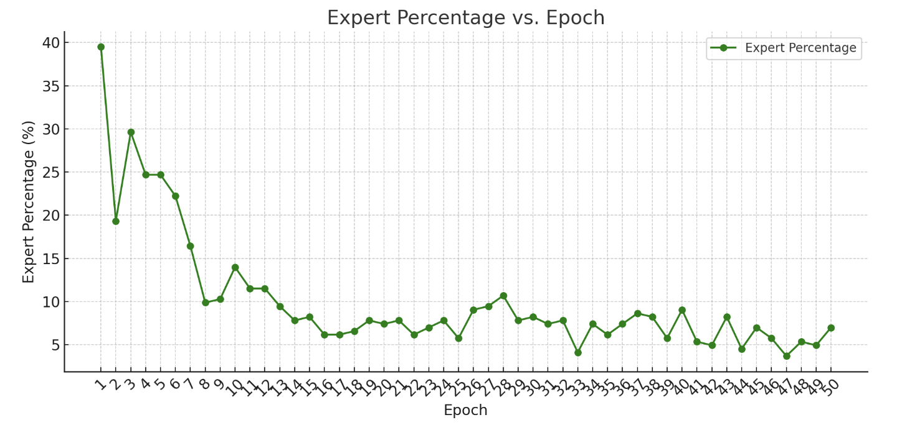
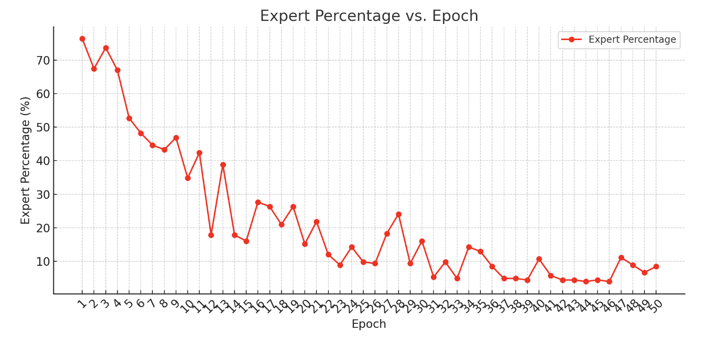
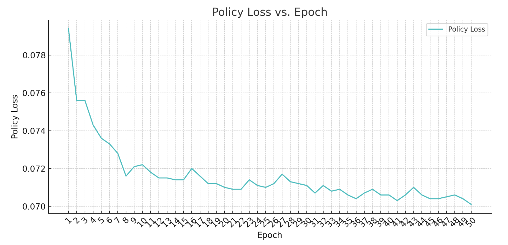

# RLassignment3

## 1. Colaborators

Eason Ding

Chuhan Li

Since we are all taking Deep Learning together, Eason took inspiration from the DL homework where we used teacher forcing to directly corperate parts of the ground truth in the outputs training RNN, and was responsible for coding up the preliminary pipelines. I was mainly responsible for integrating the teaching forcing technique into our network by experimenting with different combinations of "fake actions" (generated by the generator) and expert actions; I was also responsible for coding up and testing another form of active learning where the robot would request more demos after each round of rollout. Chuhan was responsible for experimenting with different network architectures (from HW2 checkpoints) and with different criterions, as well as for managing the computing resources of our group.

## 2. Active vs. Passive Learning

### a. Number of Interactions and Hypothesis
- The non-AL implementation for the coffee d0 task already achieves pretty good performance (see HW2 best performing task); there is actually no need for additional interactions to complete the task, but we hypothesize that some interactions could potentially help improve the efficiency/smoothness of the task performance.

- Thus, we first hope to see if the AL implementation can at least produce performance comparable to the non-AL implementation on the coffee d0 dataset. In our setup, each interaction is formulated as providing a single expert action and the amount of interactions is calculated in terms of a percentage of total actions. Since each demonstration consists around ~200 actions and the average percentage is ~10.4%, average number of interactions per epoch could be calculated as 200 * 10.04% = 20.8. See rollout in the playbacks directory. See detail below: 

- Additionally, we hope to see if AL implementation can improve the performance on the coffee d1 dataset, but was not successful. See rollout in the playbacks directory. See plot below:

### b. Results Comparison
The best performing examples of AL implementation not better than that of non-AL implementation. This means that the learning result is not benefited from seeing the "ground truth" directly in the forward pass or being trained on a much bigger training dataset. This might be from a few different reasons including the restricted input format, the diversity in the training dataset, feature selections & abstractions, and etc.

### c. Results Comparison Reasoning
The non-AL implementation did achieve comparable results on coffee d0 dataset but was unable to improve the task performance on coffee d1 dataset. 

- In the teacher forcing setup, since we tried directly concatenating expert demonstration actions and generated actions, the learned trajectories appear to be not very smooth and the robot would appear to be jumping/shaking in the rollouts. 
- We intially hypothesized that the jumping/shaking actions are due to the discrete value differences between the expert and generated actions. Thus, we also tried data augmentations where we compute an augmented action from a fixed ratio of expert action and generated action if MSE exceeds a certain threshold.
- With different combinations, the loss did generally decrease. However, we observed that the EEF could not perform any clipping actions. We suspect that this is due to the out-of-phase clipping actions in the expert demonstrations and the generated actions; so when the two actions are combined with a ratio, the clipping actions are neutralized.
- Stemming from HW2 checkpoints where we had different architectures of the same InfoGail setup, we also tested the different architectures with the AL implementation, since we hypothesized that our policy network was not complex enough to capture the variations in training data and the discriminator network was not powerful enough to learn the difference between expert demonstrations and generated actions. However, our total policy loss actually increased with the same number of epochs, suggesting under-training. We did not pursue this route furthur because of limited computing resources.
- We also experimented with different MSE threshold where the robot will prompt human for input: 0.01, 0.1, 1, 10, 100. We found that 1 and 10 are giving the best results. See rollouts in the playbacks directory.
- Additionally, since the teacher forcing technique was not particularly useful on coffee d1 dataset, we suspected that we needed much more demonstrations to compensate for the high variance in the dataset. Therefore, we formulated another form of active learning where after training on 100 demonstrations for 25 epochs with undesirable results, the robot will "ask" for more demonstrations and we would train the robot on 200 demonstrationso for another 75 epochs. However, this AL implementation was also not successful at improving task performance on this task. Please see main_d1_100_epochs.ipynb for this setup.

## 3. Number of Interactionsc vs. Performance

### a. Graph

### b. Performance Across Train/Test Datasets
The AL performance on the training set is not particularly benefited from having a bigger training set and more epochs (>> 50), though loss achieves nearly the same value as the non-AL implementation which can complete the coffee task. The loss is about ~0.004 higher on the test dataset but not varying across different distributions.

## 4. Hypothesis and Modifications
As discussed in 2a, the AL performance is as expected mostly because of the limited types of active input we can provide for the model. If given more time, I would experiment with different combinations of the training features and augment the demonstrations in some way such that the teacher forcing part would take in augmented actions between the "ground truth" and the actions action to minimize exposure bias from teacher forcing.
